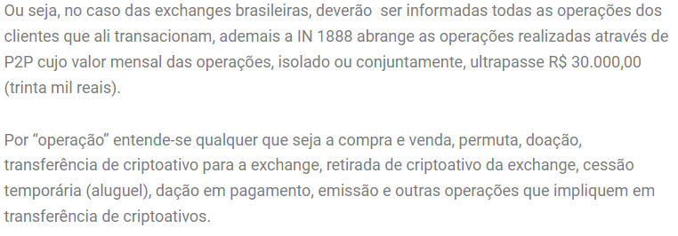

# Binance Accounting Report

```
Seguinte:
neste arquivo tem uma pasta chama GCAP, que são os arquivos de apuração de ganho de capital do fiscal cripto, você vai reparar que ele é dividido mensalmente, isso pq o GCAP é uma obrigação mensal que deve ser declarada apenas o resumo total do mês, que fica no final de cada relatório, mas o relatório mostra cada transação (permuta, venda e etc..). O GACAP tem uma condição, que seria ultrapassar o valor de R$ 35.000,00 de criptoativos vendidos no MÊS a baixo disso o declarante não precisa declarar e o resultado tem que ser positivo prejuízo no mês não é necessário declarar, mas é importante ter apurado para saber como fez o fiscal cripto, pois fica isento, caso contrario ele deve pagar 15% sob o lucro (lembrando que é importante incluir as taxas pagas para a corretora no custo de aquisição, pois assim o cliente consegue diminuir o seu imposto de maneira licita, pois se o custo de aquisição aumenta o lucro diminui).
esta é a apuração de ganho de capital
```

```
Outro arquivo que você vai encontrar é a IN1888 é uma obrigação acessória da receita federal, nela o cliente não paga imposto nenhum, apenas da informações á receita, informações de suas compras e vendas, sendo elas permutas, compra p2p, realizadas em corretoras estrangeiras ou DEFI que não entregam informações á receita federal.
Ou seja, ja que a instituição financeira não entrega as declarações fica como responsabilidade do declarante informar a receita. Esta obrigação tem uma condição que seria uma movimentação igual ou superior a 30k no mês, ja que ela também é uma obrigação mensal, ela pode ser feita manualmente no portal do ecac ou importada, para importar e necessário que esteja no formato que você ira encontrar dentro dos arquivos, que é o formato aceito pela receita
```



```
Por fim os saldos
```

[saldos](data/SALDOS/Saldo-12-2021.pdf)
[saldos](data/SALDOS/Saldo-12-2020.pdf)
[saldos](data/SALDOS/Saldo-12-2019.pdf)
[saldos](data/SALDOS/Saldo-12-2018.pdf)

```
Neste arquivo você ira encontrar os saldos apurados de cada ano de cada cripto moeda do cliente, é necessário apurar os saldos de cada cripto que o cliente tinha no dia de 31/12 de cada ano, pois este saldo deve ser declarado no imposto de renda. EXEMPLO: Cliente finalizou o ano de 2019 com um saldo de BTC = 0,050000 a um preço médio de R$ 5.000,00 (este preço médio se refere ao valor de aquisição, é "médio" pois é uma média ponderada uma vez que ele comprou e vendeu diversas vezes a preços diferentes, então deve-se somar as quantidades e dividir pelos preços) que em 31/12/2019 estava valendo um total de R$ 10.000,00. Esta declaração deve ser feita de forma individual para cada corretora, ou seja se ele tem btc na binance e na foxbit ele deve declarar duas vezes, uma da foxbit e outra da binance.
qualquer dúvida é só perguntar, ansioso pelo primeiro mvp hehehe
```
