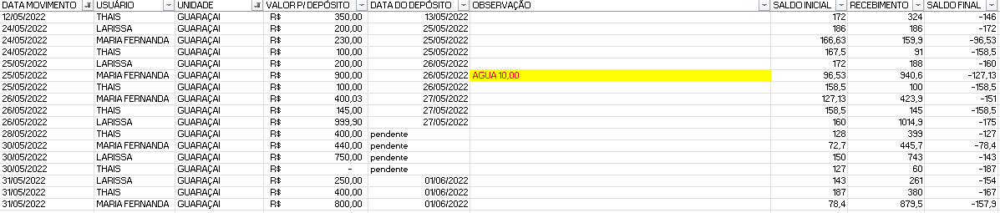

# Automation for Mastellini


[mastellini](mastellini.zip)

```
O projeto mastellini é o seguinte, é basicamente confrontar caixas e comprovantes de recebimento, o detalhe vai ser o recebimento em dinheiro, que eu preciso conferir através da planilha o valor depositado fazendo: (SALDO I + DINHEIRO - SALDO F), o resultado é o valor que deve ser depositado, eu preciso encontrar este valor no comprovante de depósito, ou a somatória deste dia com a de dias anteriores, pois nem sempre o caixa é depositado todos dia, na verdade quase sempre eles são depositados mais de um dia de uma vez, tem algumas variáveis que podem acontecer: (pode haver alguma despesa paga com dinheiro do caixa, como agua, faxina, salgados, então elas enviaram o recibo de pagamento para deduzirmos do calculo de depósito) e também existem os comprovante de pix, neste exemplo eu não mandei, mas vou mandar o de outro cliente para você verificar
outra dia no caso
```

```
um exemplo de comprovante de pix de outra unidade
```


